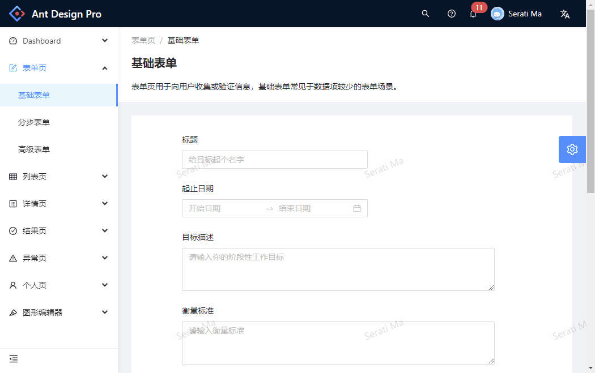
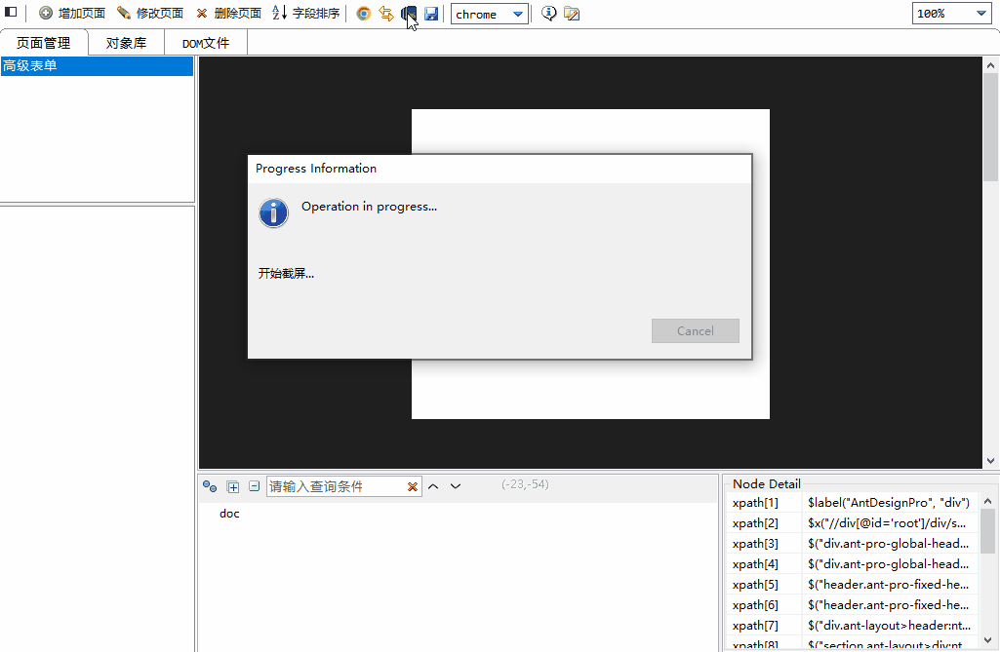
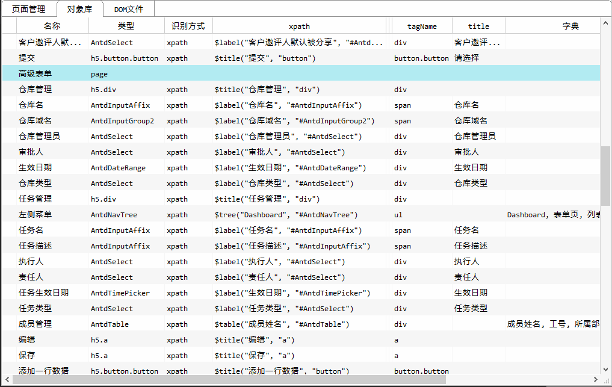

# 前言

现成的自动化工具有很多，早年间的QTP/UFT，RFT，VS TEST。后来的selenium，appium，Playwright，postman，Jmeter以及基于这些工具开发的应用级方案，如Katalon Studio，robot framework等。前几年又出现了号称AI的自动化工具，最近好像没什么动静了。随着GTP的流行，不知道又会出现哪些奇思妙想的自动化测试工具？

既然有大把的工具可以用，为什么还要费这么大的精力去做一个呢，而且还不一定能做好。主要原因还是现有的自动化工具没一个能用的，或者适配性不好，或者脚本极难维护。所以大部分的自动化项目两年以后就会进入了瓶颈期，然后变成鸡肋，维护成本巨大但效果灰常有限，基本上活不过5年。尤其是基于xpath，css selector等技术实施的UI自动化项目，因为脚本难以维护，基本上交付那一刻就是高峰期。大部分实施过UI自动化的公司，对UI自动化测试都持怀疑和观望的态度。

UI自动化工具的底层逻辑很简单，包含三部分功能：查找对象（对象定位）、操作对象、基于CV的工具，还需要判断对象类型（对象识别）。

关于对象识别，传统的自动化工具有两条技术路径。一种是采用Element的特征去定位对象，这些特征不仅仅是Element自身的属性，也可以是周边的属性，UFT主要采用这种方式定位对象；另一种是基于xpath定位对象，包括RFT、selenium，appium等。Playwright主要也是xpath定位，但也提供了一些根据Element特征定位对象的能力。

关于对象操作，实现方式基本上类似，主要是模拟鼠标键盘完成对象操作，配合少量的js直接操作对象。并且所有的对象操作指令，都是针对单个WebElement的一个操作。

实现原理相同，所以即使后面问世的工具在技术上有所创新，比如MS的Playwright提供了trace viewer，但是selenium具有先发优势，已经形成了技术路径依赖，所以也很难被替代。

# 遇到的问题
为什么说用这些工具很难开展自动化测试呢，除了业务上的因素，技术层面主要是脚本的变更适应性很差，维护成本巨大。基本上写脚本的时候有多爽，维护脚本的时候就会有多惨。
1. UFT虽然通过对象特征来识别对象，并辅助以对象库的方式保存特征信息，使脚本变得比较简洁易读，并且对象识别也有一定的变更适应能力。这种方式处理原生的H5组件比较有效，对于react、vue等框架，组件大多有div+span组合生成，很多对象找不到特征，对象识别的能力受到限制。
2. 通过xpath识别对象的工具，虽然说没有什么不能用xpath解决的，但是脚本中通篇都是毫无意义的字母，可读性和可维护性都很差。尤其是react、vue等单页框架，页面显示的内容是通过程序中的变量输出，所以组件不需要id,name等属性，导致很多xpath路径需要从body开始查找。xpath(css selector)还有一个致命问题是应对页面变更的能力很差，页面的层级只要有极小的变更，就会有大量的对象定位不到。
3. 对象操作也是一个很严重的问题。无论是UFT还是xpath工具，每个自动化指令都只能操作一个基本的WebElement，对于cascader，treeselect，datepicker等组件，一个简单的操作都需要包含大量的指令，并且稳定性很差。虽然说可以做对象封装，但是antd、element ui等组件库，每个组件都很灵活，即使同一个组件，也需要封装出大量不同的指令来驱动对象。
4. 规范性，selenium提供了极致的灵活性，总有一种方法能找到对象。优点同时也是缺点，脚本中充斥着各种奇技淫巧，接手脚本维护的人很难理解前一个人为什么要这么实现。

总之，用现有的自动化工具实施的自动化项目，脚本维护成本，执行不稳定，并且容错能力差。


# 关于自动化平台
自动化平台包含两个层面和一个衔接层：技术层（对象识别、对象定位和对象操作等）、应用成（对象库管理、测试脚本开发、测试用例维护、执行计划等），以及介于技术层和应用层中间的脚本执行引擎。

开源工具里很少有工具会同时包含这三部分功能，selenium，appium，Playwright专注于技术层；Katalon Studio，robot framework等工具专注于应用层；UFT包含技术层和执行引擎，以及脚本开发功能，应用层主要在QC（ALM）中。

国内厂商做的自动化平台基本上是应用层的功能，加上简单的selenium，appium封装，甚至连执行引擎都是通过shell指令在工具外执行（比如交给python命令行执行）。

# 自动化工具的一些目标
matrix的WEB自动化工具主要用于表单类应用（后台管理等）的自动化测试；能有限支持信息查询类，或电商类应用；不支持游戏类应用。

工具希望能够在对象识别、对象定位和对象操作上有一些开拓，能有限的解决上面上面提到的这些问题。
完全做一个底层自动化引擎显然不太现实，所以工具不会像UFT、RFT、Playwright那样，包含一个完全独立的浏览器驱动引擎。

matrix需要依赖selenium实现和浏览器的交互，但不会包括selenium的八大对象识别功能:smile:。

- *对象层的功能主要包括：*
1. 对象识别基本上需要重新实现，工具不会使用xpath和css selector定位对象，考虑到功能的完备性，会支持selenium的对象识别功能。
2. 对象操作需要借助selenium的通道，但是组件需要按一个整体来操作，而不是把一个组件拆分成不同的零件。
3. selenium不提供对象识别的功能，对象识别可以在脚本开发阶段完成，也可以在脚本执行阶段实现，对于AI自动化工具而言，必须要在脚本执行阶段实现对象识别的能力。

- *工具需要包含一个基本可用的执行引擎。*
1. 脚本在进程内执行，支持断点调试、错误干预后继续执行等基本功能。
2. 需要支持脚本连续执行的能力，不能每个脚本执行完后就需要关闭浏览器，下一个脚本需要重新登录等。
3. 需要支持全局session管理，接口测试和UI测试共用session，只登录一次。
4. 尝试单机并发执行。

- *需要一个完整的应用层功能。*
包括对象库管理、脚本开发调试、测试用例管理、数据管理、流程编排、执行计划等基本功能。

# 执行效果
先看一下基本效果。demo测试网站：[antd pro](https://preview.pro.ant.design/)

*脚本执行效果图*

因为每个指令都包含了执行后的正确性检查及错误重试机制，所以会影响执行速度，但是非常稳定。脚本中不会有各种等待，尤其是强制等待。

# groovy脚本
因为脚本需要在进程内执行，所以选择了jvm支持的groovy脚本。
```groovy
public class TestScript
{
   public void onFinish( TestResult res, LzException exception )
   {
      if( exception != null ){
         // 执行异常
         MiscUtil.screenShot( "执行异常" )
      }
   }

   public String svcCode = MiscUtil.formatSvcCode( S("AntPro") );
   public void testScript()
   {
      WebClient.openBrowse( S("https://preview.pro.ant.design/") )
      WebPage2 高级表单 = WebClient.WebPage( S("AntPro"), S("高级表单") )

      // 点击导航菜单
      高级表单.WebTree("左侧菜单").click( S("表单页/高级表单") )

      // 仓库管理
      高级表单.WebObject("仓库名").setValue( S("仓库名称") )
      高级表单.WebObject("仓库域名").setValue( S("mytest") )
      高级表单.WebObject("仓库管理员").setValue( S("周毛毛") )
      高级表单.WebObject("审批人").setValue( S("周毛毛") )
      高级表单.WebObject("生效日期").setValue( S("20230608,20230903") )
      高级表单.WebObject("仓库类型").setValue( S("公开") )

      // 任务管理
      高级表单.WebObject("任务名").setValue( S("任务名") )
      高级表单.WebObject("任务描述").setValue( S("任务描述") )
      高级表单.WebObject("执行人").setValue( S("周毛毛") )
      高级表单.WebObject("责任人").setValue( S("周毛毛") )
      高级表单.WebObject("任务生效日期").setValue( S("221008") )
      高级表单.WebObject("任务类型").setValue( S("公开") )

      // 修改成员
      高级表单.WebTable("成员管理").cellBtnClick( S("工号(00002)"), S("操作"), S("编辑") )
      高级表单.WebTable("成员管理").setCellValue( S("工号(00002)"), S("成员姓名"), S("input"), S("马农") )
      高级表单.WebTable("成员管理").setCellValue( S("2"), S("工号"), S("input"), S("00005") )
      高级表单.WebTable("成员管理").setCellValue( S("2"), S("所属部门"), S("input"), S("后勤") )
      高级表单.WebTable("成员管理").cellBtnClick( S("2"), S("操作"), S("保存") )

      // 增加成员
      高级表单.WebButton("添加一行数据").click()
      高级表单.WebTable("成员管理").setCellValue( S("4"), S("成员姓名"), S("input"), S("张三") )
      高级表单.WebTable("成员管理").setCellValue( S("4"), S("工号"), S("input"), S("1004") )
      高级表单.WebTable("成员管理").setCellValue( S("4"), S("所属部门"), S("input"), S("开发部") )
      高级表单.WebTable("成员管理").cellBtnClick( S("4"), S("操作"), S("保存") )

      // 提交表单
      高级表单.WebButton("提交").click()
   }
}
```
这个脚本的最大特点就是简洁，每个指令都完成一个业务操作，一个setValue指令搞定一切。比如从下拉框选择数据的指令【 `高级表单.WebObject("仓库管理员").setValue( "周毛毛" )` 】，这个指令包括打开下拉列表，从下拉列表中选择数据两个步骤。并且这个指令和UI组件库无关，他支持antd、element ui等组件库。

# 关键字脚本
很多人不愿意写这种程序形式的脚本，工具也支持关键字驱动的脚本，上面的这个groovy脚本，是从下面这个关键字脚本生成的。
```
脚本开始==AntPro==
WebOpenBrowse==%url%==

#定义页面
WebDefPage==高级表单==AntPro==高级表单==

#点击导航菜单
WebTreeClick==高级表单.左侧菜单==%高级表单.Dashboard%==

#仓库管理
WebSetValue==高级表单.仓库名==%高级表单.仓库名%==
WebSetValue==高级表单.仓库域名==%高级表单.仓库域名%==
WebSetValue==高级表单.仓库管理员==%高级表单.仓库管理员%==
WebSetValue==高级表单.审批人==%高级表单.审批人%==
WebSetValue==高级表单.生效日期==%高级表单.生效日期%==
WebSetValue==高级表单.仓库类型==%高级表单.仓库类型%==

#任务管理
WebSetValue==高级表单.任务名==%高级表单.任务名%==
WebSetValue==高级表单.任务描述==%高级表单.任务描述%==
WebSetValue==高级表单.执行人==%高级表单.执行人%==
WebSetValue==高级表单.责任人==%高级表单.责任人%==
WebSetValue==高级表单.任务生效日期==%高级表单.任务生效日期%==
WebSetValue==高级表单.任务类型==%高级表单.任务类型%==

#修改成员
WebTableButtonClick==高级表单.成员管理==工号(00002)==操作==编辑==
WebSetCellValue==高级表单.成员管理==工号(00002)==成员姓名==input==%高级表单.修改成员姓名%==
WebSetCellValue==高级表单.成员管理==2==工号==input==%高级表单.修改工号%==
WebSetCellValue==高级表单.成员管理==2==所属部门==input==%高级表单.修改所属部门%==
WebTableButtonClick==高级表单.成员管理==2==操作==保存==

#增加成员
WebClick==高级表单.添加一行数据==
WebSetCellValue==高级表单.成员管理==4==成员姓名==input==%高级表单.增加成员姓名%==
WebSetCellValue==高级表单.成员管理==4==工号==input==%高级表单.增加工号%==
WebSetCellValue==高级表单.成员管理==4==所属部门==input==%高级表单.增加所属部门%==
WebTableButtonClick==高级表单.成员管理==4==操作==保存==

WebClick==高级表单.提交==
脚本结束==

```
关键字的好处很多，比如可用翻译成各种不同的脚本，可以把多个指令封装成一个关键字等。

# 对象库维护
脚本采用对象库方式实现，对象库的维护页面

这个功能参考了UI Automation的设计思路，先从浏览器中提取DOM结构和截图，然后手工选择对象并添加。

最早的版本能自动提取所有对象，表单页面应该问题不大。针对很多数据采集页面，比如订灰机票，会从页面上提取大量的瞄点（link）对象，所以选择了手工选择对象的方式。

# 对象表
最后看一下对象表的内容
完全没有使用xpath或css selector，对象都是通过（可见）特征查找，所以即使只有页面原型也能编写自动化脚本。



以上大部分是WEB自动化测试的功能，接口测试工具做的比较早，后续需要再整理整理，柜面自动化比较成熟，最后再整理吧。
