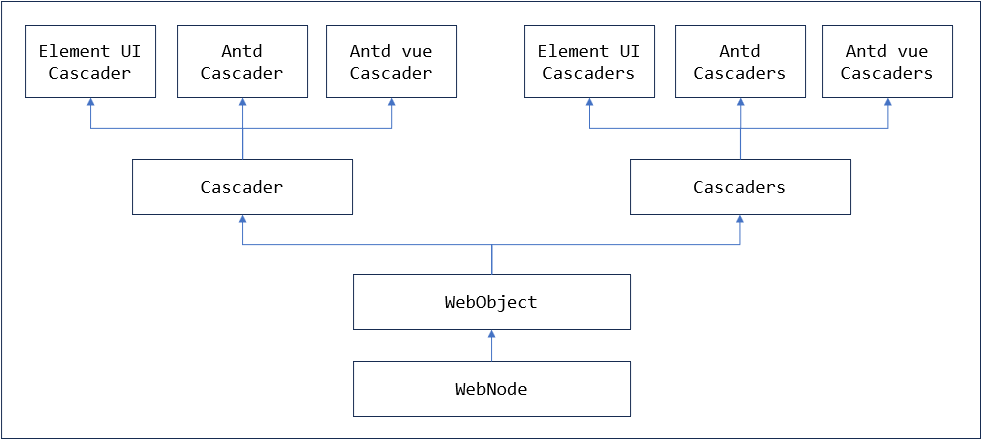
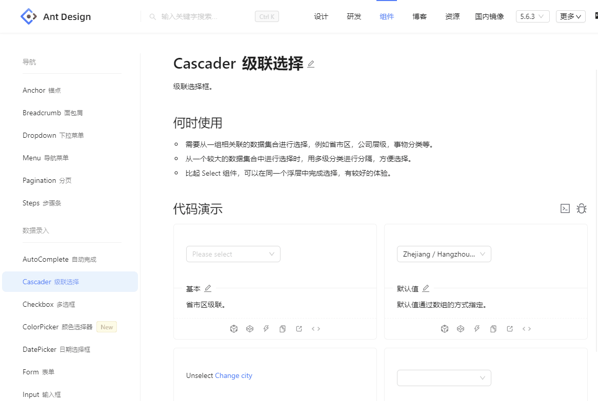
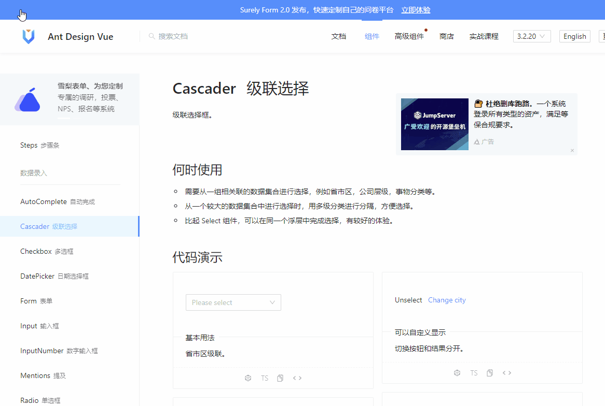
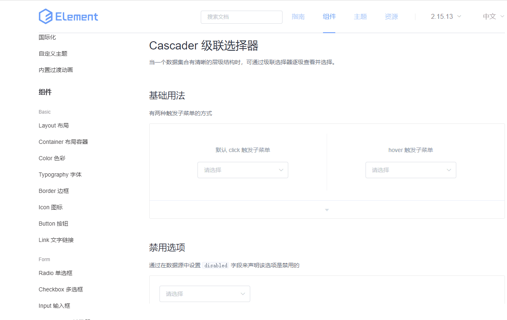

# cascader 对象封装

支持antd5、antdv3、element ui2的cascader组件，单选和多选。

对象封装结构




## 基本用法

兼容多个不同的UI组件库，使用相同的关键字和对象定位方法。

cascader组件的主要操作包括：
- 选择数据
- 取数据；

次要操作包括：
- 取下拉列表的值。

### antd5 

【[antd v5 的 cascader 组件](https://ant-design.antgroup.com/components/calendar-cn)】的执行效果



**自动化脚本**
```
WebDefPage==cascader==表单组件==cascader==
WebSetValue==cascader.Cascader1==Zhejiang / Hangzhou / West Lake==
WebGetValue==Cascader1==cascader.Cascader1==

WebSetValue==cascader.Cascader11==Zhejiang / Hangzhou / West Lake==
WebGetValue==Cascader11==cascader.Cascader11==

WebSetValue==cascader.多选==Light/Number1,Light/Number4,Bamboo/Little/Toy Cards==
WebGetValue==多选==cascader.多选==
```


***

### antd vue 3

【[antd vue v3 的 cascader 组件](https://www.antdv.com/components/cascader-cn)】的执行效果



**自动化脚本**
```
WebDefPage==cascader==表单==cascader==
WebSetValue==cascader.单选==Zhejiang / Hangzhou / West Lake==
WebGetValue==Pleaseselect==cascader.单选==

WebSetValue==cascader.带注释==Zhejiang / Hangzhou / West Lake==
WebGetValue==带注释==cascader.带注释==

WebSetValue==cascader.多选==Light/Number1,Light/Number4,Bamboo/Little/Toy Cards==
WebGetValue==多选==cascader.多选==
```


***

### element ui 2

【[element ui 2 的 cascader 组件](https://element.eleme.cn/#/zh-CN/component/cascader)】的执行效果



**自动化脚本**
```
WebDefPage==级联选择==功能演示==级联选择==
WebSetValue==级联选择.请选择==组件 / Notice / Alert 警告==
WebGetOptions==请选择Opts==级联选择.请选择==

WebDefPage==cascaderMenu5==功能演示==cascaderMenu5==
WebSetValue==cascaderMenu5.默认click触发子菜单==组件 / Form / Input 输入框==
WebSetValue==cascaderMenu5.hover触发子菜单==组件 / Form / InputNumber 计数器==
WebGetValue==默认click触发子菜单==cascaderMenu5.默认click触发子菜单==

WebSetValue==cascaderMenu5.默认click触发子菜单==指南 / 导航 / 顶部导航==

WebDefPage==cascader2==功能演示==cascader2==
WebSetValue==cascader2.默认显示所有Tag==东南 / 江苏 / 苏州,东南 / 浙江 / 宁波==
WebGetValue==默认显示所有Tag==cascader2.默认显示所有Tag==
```

element ui2 有多个WebDefPage，是因为这个演示页面不支持长截图，所以对象提取到了多个页面。

***

## 对象封装

公共方法参见WebNode和WebObject

### cascader

针对cascader组件的特殊封装包括：setValue，getValue和getOptions三个方法；没有封装isDisabled。getOptions只取下拉列表的第一级。

setValue的参考流程。

```java
protected void setValue2( String value, boolean isCheckEnable )
{
   // 格式化值，删除中间的空格等
   value = formatValue( value );
   
   // 判断值是否相同
   if( isComplete(value) ) {
      return;
   }
   
   // 查找对象
   WebObject webObj = getH5Object();
   
   int retry = 0;
   while( retry++ < 6 ) {
      if( value == null || value.isEmpty() ) {
         // 清空
         clear( webObj );
      }
      else {
         // 打开下拉框
         dropDown( webObj );
         
         // 等待下拉框打开
         int delay = (retry - 1) * 70;
         if( delay > 0 ) {
            MiscUtil.sleep( delay );
         }
         
         // 选择
         doSelect( webObj, value );
      }
      
      // 比较结果
      if( isComplete(value) ) {
         return;
      }
   }
   
   throw new LzException( "E908", "预期输入["+value+"]，实际输入["+getValue()+"]" );
}


// doSelect 的过程
protected void doSelect( WebObject webObj, String value )
{
   List<String> list = StringUtil.split( value,  '/' );
   
   // 逐层选择
   int count = list.size();
   for( int i=0; i<count; i++ ) {
      ElementByScript byScript2 = new ElementByScript( getItemScript(), null, i, list.get(i) );
      if( i == count-1 ) {
         // 最后一段
         WebUtil.dynItemClick( byScript2, false );
      }
      else {
         String title = list.get(i);
         
         // 检查是否选中，需要重试
         int retry = 0;
         while( retry++ < 6 ) {
            // 点击选择项
            WebUtil.dynItemClick( byScript2, true );
            
            // 等待第 i 层弹窗打开
            boolean rc = waitPopupWindow( 50*retry, i+1 );
            if( !rc ) {
               continue;
            }
            
            // 判断是否选中
            String title2 = getSelectedValue( i );
            if( title.equals(title2) ) {
               break;
            }
            
            // 重试
            MiscUtil.sleep( 50 );
         }
      }
   }
}
```

**开放接口**

不同的UI组件库，需要定制封装的部分。

| 名称 | 说明 |
| --- | --- |
| getItem | 下拉列表中取对象 |
| getOptions | 取某个层级的选项 |
| getValue | 取下拉框的值 |
| getSelectedValue | 下拉表中某个层级的选中值 |
| getOpenItem | 打开下拉框的图标 |
| getClearItem | 清空下拉框的图标 |
| getPopupWindow | 取弹出窗口 |


### cascaders

针对cascaders组件的特殊封装包括：setValue，getValue和getOptions三个方法；没有封装isDisabled。getOptions只取下拉列表的第一级。

setValue的参考流程。

```java
protected void setValue2( String value, boolean isCheckEnable )
{
	// 需要选择的数组
	List<String> values = formatValues( value );
	
	// 打开下拉框
	WebObject webObj = getH5Object();
	
	// 需要错误重试
	for( int retry=0; retry<6; retry++ ) {
		// 已经选中的值
		List<CascaderItem> items = getItems( webObj );
		
		// 检查值是否有变化
		if( isComplete(values, items) ) {
			return;
		}
		
		// 清空
		if( value == null || value.isEmpty() ) {
			boolean rc = clear( webObj );
			if( rc ) {
				// 需要检查内容正确性
				continue;
			}
		}
		
		// 打开下拉框
		dropDown( webObj );
		
		// 等待下拉窗口打开
		MiscUtil.sleep( retry*40 );
		
		// 不选中
		deselectValues( webObj, values, items );
		
		// 选中
		selectValues( webObj, values, items );
		
		// 关闭选择框
		WebUtil.pressEscape();
	}
	
	throw new LzException( "E908", "预期输入["+value+"]，实际输入["+getValue()+"]" );
}

// selectValues和deselectValues 类似单选的处理
```

**开放接口**

不同的UI组件库，需要定制封装的部分。

| 名称 | 说明 |
| --- | --- |
| getItem | 下拉列表中取对象 |
| getOptions | 取某个层级的选项 |
| getSelectedItems | 取输入框中选中的项 |
| getSelectedValue | 下拉表中某个层级的选中值 |
| getOpenItem | 打开下拉框的图标 |
| getClearItem | 清空下拉框的图标 |
| getPopupWindow | 取弹出窗口 |


