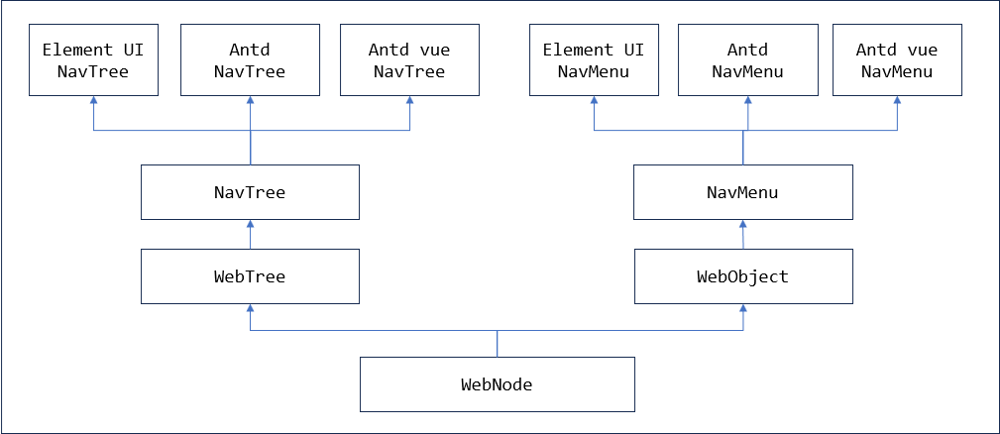
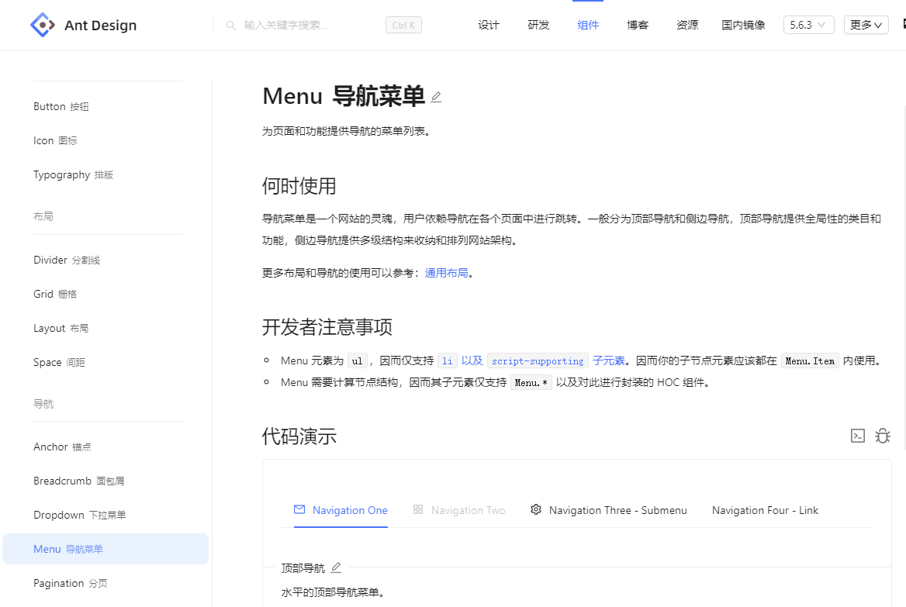
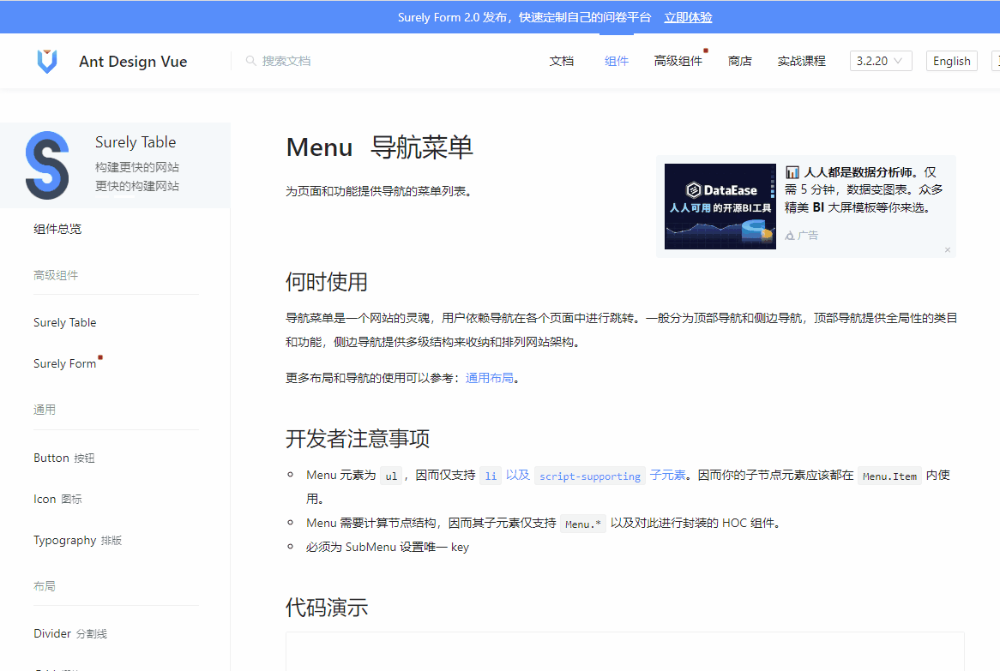
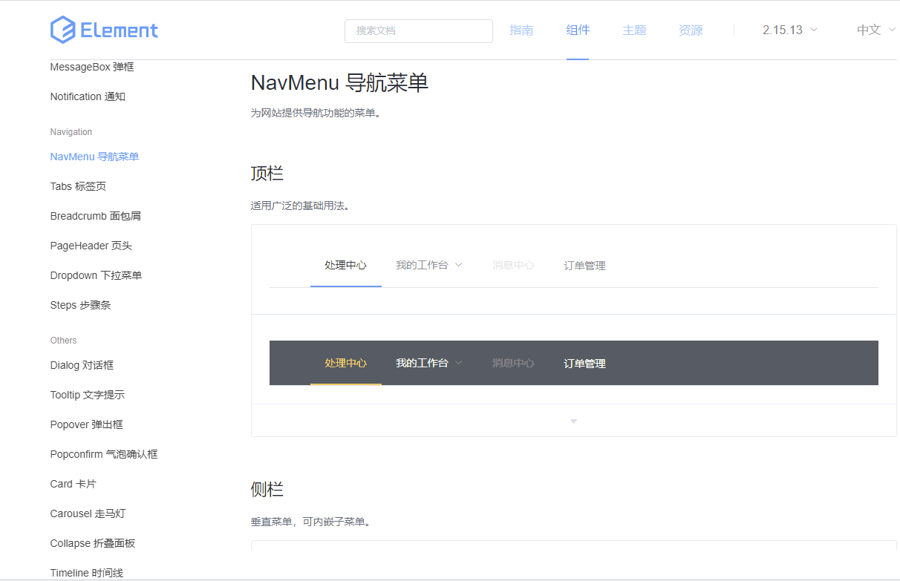

# NavMenu 对象封装

支持antd5、antdv3、element ui2的NavMenu(menu)组件，支持顶部菜单和左侧功能树。

对象封装结构



包含两种组件，顶部菜单从WebObject派生，左侧功能树从WebTree派生

## 基本用法

兼容多个不同的UI组件库，使用相同的关键字和对象定位方法。

NavMenu和NavTree组件的主要操作包括：
- 点击功能菜单项；

次要操作包括：
- 取当前选中的菜单项。

### antd5 

【[antd v5 的 menu 组件](https://ant-design.antgroup.com/components/menu-cn)】的执行效果



**自动化脚本**
```
WebDefPage==menu==导航==menu==

// 左侧菜单
WebTreeClick==menu.功能目录==Navigation One/Option2==
WebTreeGetValue==功能目录==menu.功能目录==

// 顶部菜单
WebSetValue==menu.导航菜单==Navigation Three - Submenu/Option3==
```


***

### antd vue 3

【[antd vue v3 的 menu 组件](https://www.antdv.com/components/menu-cn)】的执行效果



**自动化脚本**
```
WebDefPage==menu==导航==menu==

// 左侧菜单
WebTreeClick==menu.功能目录==Navigation One/Option2==
WebTreeGetValue==功能目录==menu.功能目录==

// 顶部菜单
WebSetValue==menu.导航菜单==Navigation Three - Submenu/Option3==
```


***

### element ui 2

【[element ui 2 的 NavMenu 组件](https://element.eleme.cn/#/zh-CN/component/menu)】的执行效果



**自动化脚本**
```
WebDefPage==NavMenu2==功能演示==NavMenu2==

// 顶部菜单
WebSetValue==NavMenu2.处理中心==订单管理==
WebGetValue==处理中心==NavMenu2.处理中心==
WebGetOptions==处理中心Opts==NavMenu2.处理中心==

SwitchToWindow==0==
WebSetValue==NavMenu2.处理中心==我的工作台/选项4/选项2==

// 左侧菜单
WebTreeClick==NavMenu2.导航菜单==导航一/选项2==
WebTreeGetValue==选中值==NavMenu2.导航菜单==
```

***

## 对象封装

### NavMenu

公共方法参见WebNode和WebObject

针对NavMenu组件的特殊封装包括：setValue，getValue和getOptions三个方法。getOptions只取第一层菜单项

setValue的参考流程。

```java
// 点击菜单
protected void setValue2( String value, boolean isCheckEnable )
{
   // 菜单项数组
   List<String> list = StringUtil.split( value, '/' );
   
   // 查找对象
   WebObject webObj = getH5Object();
   
   // 点击主菜单
   String str = HintWindow.formatTitle( list.get(0) );
   dropDown( webObj, str, (count>1) );
   
   // 子菜单
   for( int i=1; i<count; i++ ) {
      String title = HintWindow.formatTitle( list.get(i) );
      clickMenuItem( i, title, (i != count-1) );
   }
}

// 点击子菜单
protected void clickMenuItem( int level, String title, boolean isWaitOpen )
{
   String jsFile = getPopupItemScript();
   ElementByScript byScript2 = new ElementByScript( jsFile, null, level-1, title );
   
   if( !isWaitOpen ) {
      // 关闭消息框
      WebUtil.closeAutoHints();
      
      // 点击菜单
      clickMenuItem( byScript2, isWaitOpen );
   }
   else {
      // 等待菜单弹出
      for( int i=0; i<6; i++ ) {
         clickMenuItem( byScript2, isWaitOpen );
         
         // 等待弹出窗口
         boolean rc = waitPopupWindow( 50*(i+1), level-1 );
         if( rc ) {
            break;
         }
      }
   }
}
```

**开放接口**

不同的UI组件库，需要定制封装的部分。

| 名称 | 说明 |
| --- | --- |
| getItem | 取菜单项 |
| getOptions | 取所有菜单项 |
| getValue | 取选中的菜单项 |
| getPopupItem | 弹出菜单中取对象 |
| getPopupWindow | 弹出菜单窗口 |


### NavTree

NavTree是一个树状结构的组件，按tree组件封装要求，需要定制tree组件的开放接口。


| 名称 | 说明 |
| --- | --- |
| getTreeNodes | 取第一层节点 |
| getChildNodes | 取子节点 |
| getTreeNode | 查找第一层节点 |
| getChildNode | 查找子节点 |
| getSelectedNode | 取选中的节点 |


