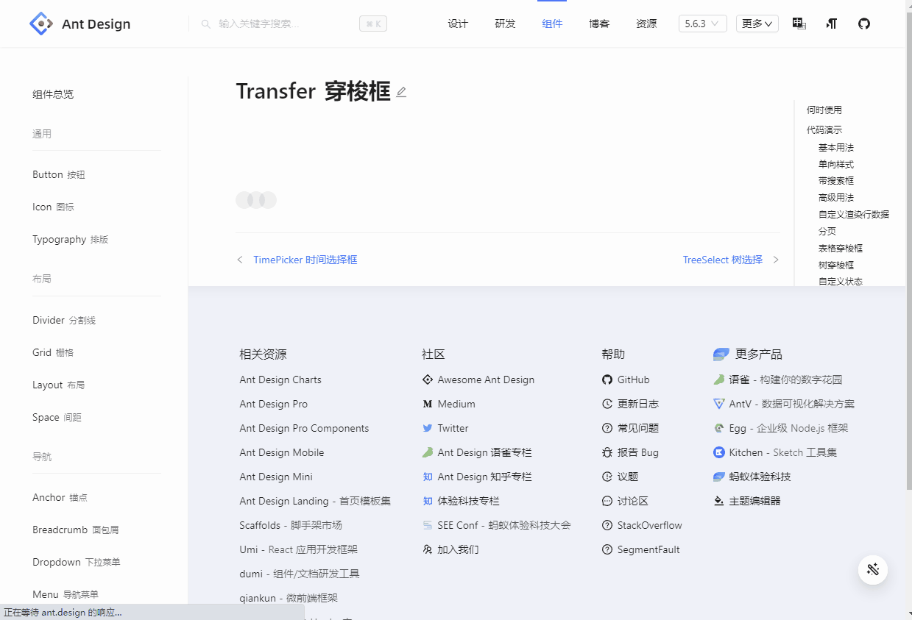

**如何提高自动化脚本的稳定性**

每次执行脚本都会提心吊胆，尤其是演示的时候，不知道什么时候会掉链子。:cry::cry::cry:

**关于selenium自动化测试中的等待**

自动化测试中的等待问题，一直是个要命的问题。

很多人可能和我类似，就是在自动化脚本中不能容忍sleep这种强制等待的方式，因为你根本不知道sleep多少时间。有的时候网络好，执行机性能强，可能很快就满足了执行条件；而另外一些时间，可能你指定的等待时间，系统还没准备好。

selenium提供了两种等待方式（显式等待和隐式等待），操作系统提供了sleep这种强制等待的指令，具体是什么意思我就不解释了，因为一个我也不知道这些有什么用，另一个网上有大量粗糙的文章解释这些内容。

我想说的是如果你要做一个能够稳定执行的脚本，selenium提供的这两种等待方式有用吗。不信的话你可以试一下【[transfer](https://ant-design.antgroup.com/components/transfer-cn)】这个组件。你打开这个网页，然后用鼠标点击第一个transfer框内的那些checkbox，你发现能点中吗。贴一个执行效果图（为了节约时间，已经删除了很多帧）

脚本很简单
```
WebSetValue==transfer.穿梭框==content2,content3,content14,content15,content16==
WebSetValue==transfer.穿梭框2==content2,content3,content5,content12,content18==
WebSetValue==transfer.表格==content2,content3,content4,content9,content12,content15==
```
第一个transfer被滚动到页面中间时，就说明脚本认为页面已经加载完成，后面有几个ajax调用，脚本在几个ajax调用的间隔内做了一些操作。然后content12变蓝的时候，说明这个对象已经被click了，但是没有选中，后来content13也变蓝了，好像也没选中，这段时间大概有4000毫秒。

这是一个react应用，页面是根据内存中的变量生成，所以虽然点击了checkbox，但是页面正在渲染，程序中没有触发事件，内存变量没有变化，导致界面也没有变化。


每个指令执行以前会都执行以下必要步骤：
1. 检查 `document.readyState == 'complete'`
2. 检查 ajax调用队列是空的，或者说页面中没有正在处理的后台请求
3. 等待(FluentWait.until)对象是可操作的，检查对象是否exist，visible，有时会判断 readOnly

matrix没有检查在等待开始和等待结束之间，DOM树是否有变化，因为这个变化太频繁了。

不管是显式等待和隐式等待，在这里显然都不会起作用。

这个框架的底层用了selenide，这是官方提供的java框架，selenide中用的等待机制，要比FluentWait.until复杂很多。他把By和Action放在一个包里，在By查找对象时用了FluentWait.until，同时也检查了对象是否可交互，然后交给Action处理，无论是By出了错还是Action出了错，都会在总控层重试整个过程。（Actions也需要错误重试，比如点击一个被层覆盖的对象，需要重试直到层被隐藏）

就是这么复杂的一套机制也完全无效，所以想要做出一个稳定的自动化脚本很不容易。

**什么情况下等待会无效**

这个例子是页面在初始化时，操作第一个WebElement很可能会不成功，其他情况下也会出现这种问题吗，是的，只要你操作的是动态生成的元素，很大概率会出现这种情况。不幸的是，在单页应用中，很多内容是动态生成的，包括：
- 表格中显示的数据，每次查询或翻页时，内容都是动态生成的，导致行中的按钮（比如编辑、删除等）很可能点不上。
- tree组件中的节点，包括左侧的功能目录（NaviTree）和数据目录（DataTree），展开节点时，内容都是动态生成的。
- 所有弹出的下拉框，比如select，dropdown，弹出菜单等。在你要点击的对象被显示出来（对象可用），和总个popup被显示出来之间是有时间差，很可能找到的对象发生了变化。
- 其他页面上动态增加或删除的元素，尤其是加了动画的元素。比如【[upload](https://ant-design.antgroup.com/components/upload-cn)】，你可以试一下在脚本中删除两个文件。（我在Upload组件中加了错误重试机制，删除文件后会检查文件列表中文件是否真的被删除了，结果很长一段时间文件都在，导致最后一次重试时删除了下一个文件。或者说找的时候是前一个文件，点击的时候前一个文件已经被清除了，所以点到了下一个文件）。

**如何提高脚本的稳定性**

每次执行脚本都会提心吊胆，尤其是演示的时候，不知道什么时候会掉链子。所以人家大公司在演示AI的时候，也要提前录好。:smile:

本来脚本执行的好好的，突然有一天他们告诉我【[select](https://element.eleme.cn/#/zh-CN/component/select)】输入的内容都是错误的，本来应该选择第三项，结果都选了第一项。:unamused::unamused::unamused:。

什么原因造成的，不清楚，很可能是找到对象时，下拉框的popup windows还在向下扩展。因为那天机器执行速度太快，虽然很快找到了第三个节点，但是在点击的时候，第三个节点已经向下移动了，所以点击到了第一个节点。

怎么解决这个问题。如果你做的操作在页面上有反馈，比如上面这个select框，选完了就会显示在输入框里，这种情况最好做个后检查和重试功能。有些操作没有反馈，比如【[dropdown](hhttps://element.eleme.cn/#/zh-CN/component/dropdown)】，你点了一个菜单项，并不知道这个菜单项是不是就是你要点的那个。

错误重试机制原理很简单，每次做完操作，你把页面上的数据读出来和输入项比较一下，但实现起来很复杂。

除了错误重试机制以外，在指令执行前也可以做一些处理，以便提高指令的正确性，尤其是像dropdown，popup menu等这种没有反馈信息的操作。
在工具中，所有对弹出的选择窗口，以及树节点的操作，都会连续读两次（或者查找两次），如果内容一致说明可以操作，如果内容不同再读两次。

```java
public static void dynItemClick( By by, boolean isNeedHover )
{
   String str = WebFactory.$(by).getText();
   for( int i=0; i<40; i++ ) {
      MiscUtil.sleep( 30 );
      
      // 两次定位的对象是同一个
      String str2 = WebFactory.$(by).getText();
      if( str2.isEmpty() ) {
         // 对象已释放
         continue;
      }
      
      if( StringUtil.isEqual(str, str2) ) {
         break;
      }
      
      str = str2;
   }
   
   // hover
   if( isNeedHover ) {
      WebFactory.$(by).hover();
      MiscUtil.sleep( 5 );
   }
   
   // 点击
   WebFactory.$(by).click();
}
```

（这个不能保证操作的正确性，后来确实也出现了错误，需要进入重试流程）

这个过程会影响执行效率（click被我缩短了80毫秒，也能补回来吧:smile:）。但是考虑到页面上大部分都是input，所以也能接受。事实上页面渲染的速度没有那么快，尤其在页面中还加了效果，所以不在这里等待，就要在错误检查的地方等待。

错误重试的过程比这要复杂的多，基本上每种组件都会有差异，比如上面那个Upload组件的错误重试就很复杂。


